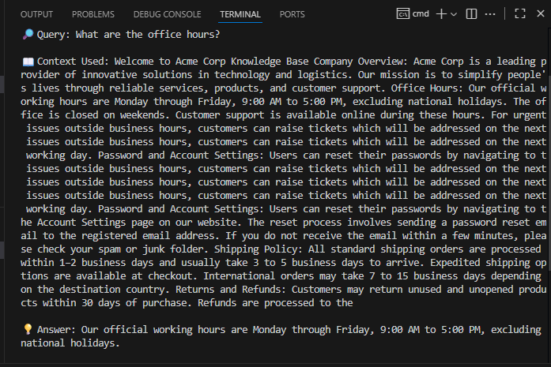

# AI Q&A Bot 🤖

An intelligent document analysis system that lets you ask questions about any uploaded document and get relevant answers in real-time.

## 🎥 Demo
## Screenshot


## Video
https://github.com/user-attachments/assets/ac2b3782-94f8-41a2-be63-ff0f01397be8


## ✨ Features

- 📁 Drag-and-drop file upload interface
- 💬 Natural language Q&A about document contents
- 🎨 Modern, responsive UI with gradient aesthetics
- ⚡ Real-time streaming responses
- 🔒 Secure file handling with automatic cleanup

## 🚀 Quick Start

1. Clone the repository:
```bash
git clone https://github.com/yourusername/qa-bot.git
cd qa-bot
```

2. Install dependencies:
```bash
npm install
```

3. Start the server:
```bash
npm start
```

4. Open http://localhost:3000 in your browser

## 🏗️ Architecture

### Frontend (public/index.html)
- Modern UI with gradient design
- Drag & drop file upload
- Real-time response streaming
- Error handling and loading states

### Backend (index.js)
- Express.js server
- Multer for file handling
- Secure file processing
- Automatic cleanup after analysis

## 🛠️ Tech Stack

- **Frontend**: HTML5, CSS3, Vanilla JavaScript
- **Backend**: Node.js, Express
- **File Handling**: Multer
- **AI Processing**: Custom QA Bot implementation

## 🔄 API Endpoints

### POST /query
Upload a file and ask questions about its contents.

```javascript
// Request (multipart/form-data)
{
  file: File,
  query: string
}

// Response
{
  answer: string
}
```

## 🎯 Use Cases

1. **Document Analysis**
   - Legal document review
   - Research paper analysis
   - Technical documentation queries

2. **Educational Support**
   - Study material comprehension
   - Quick document summarization
   - Exam preparation

3. **Business Intelligence**
   - Contract analysis
   - Report interpretation
   - Policy review

4. **Content Research**
   - Market research analysis
   - Competitive analysis
   - Data extraction

## 🔜 Future Enhancements

- [ ] Support for multiple file formats (PDF, DOCX, TXT)
- [ ] Chat history persistence
- [ ] Document highlighting for answers
- [ ] Batch processing capability
- [ ] Export conversation history

