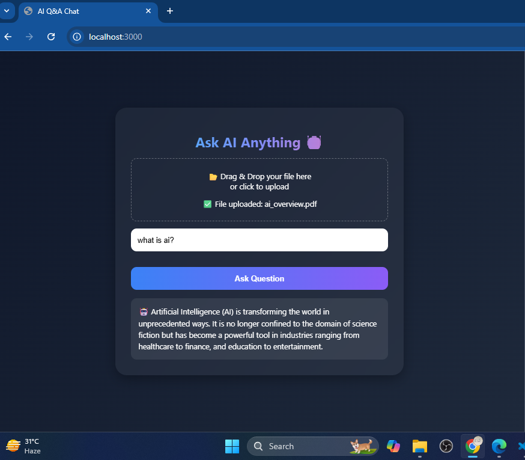

# AI Q&A Bot 🤖

An intelligent document analysis system that lets you ask questions about any uploaded document and get relevant answers in real-time.

## 🔴 Demo
## 🖼️ Screenshot

## 🎥 Video
https://github.com/user-attachments/assets/ac2b3782-94f8-41a2-be63-ff0f01397be8

⬇️[Demo Video Download](assets/demo-v1.mp4)

## ✨ Features

- 📁 Drag-and-drop file upload interface
- 💬 Natural language Q&A about document contents
- 🎨 Modern, responsive UI with gradient aesthetics
- ⚡ Real-time streaming responses
- 🔒 Secure file handling with automatic cleanup

## 🎯 Use Cases

1. **Document Analysis**
   - Legal document review
   - Research paper analysis
   - Technical documentation queries

2. **Educational Support**
   - Study material comprehension
   - Quick document summarization
   - Exam preparation

3. **Business Intelligence**
   - Contract analysis
   - Report interpretation
   - Policy review

4. **Content Research**
   - Market research analysis
   - Competitive analysis
   - Data extraction
   - 

## 🏗️ Architecture

### Frontend (public/index.html)
- Modern UI with gradient design
- Drag & drop file upload
- Real-time response streaming
- Error handling and loading states

### Backend (index.js)
- Express.js server
- Multer for file handling
- Secure file processing
- Automatic cleanup after analysis

## 🛠️ Tech Stack

- **Frontend**: HTML5, CSS3, Vanilla JavaScript
- **Backend**: Node.js, Express
- **File Handling**: Multer
- **AI Processing**: Custom QA Bot implementation

